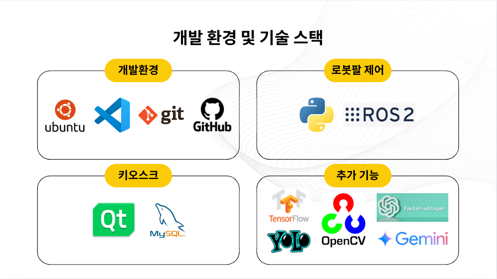

# Bartendroid
[ROS2와 AI를 활용한 자율주행 로봇개발자 부트캠프 단기 심화 2기] (10.28 - 12.27)

주관 : [애드인에듀](https://addinedu.com/), [PinkLAB](https://www.pinklab.art/), [XYZ](https://xyzcorp.io/home)

1차 프로젝트 : [ARIS로봇](https://xyzcorp.io/aris)을 활용한 아이스크림 제공 서비스 구축

작업 기간 : 10.28 - 11.22

3조 : 손유정(팀장), 김재우, 류재상, 정영훈, 윤성주, 김윤범

## 목차
- [프로젝트 소개](#프로젝트-소개)
- [프로젝트 내 기능](#프로젝트-내-기능)
- [개발 환경](#개발-환경)
- [키오스크 플로우 차트](#키오스크-플로우-차트)
- [로봇 구동 플로우 차트](#로봇-구동-플로우-차트)
- [ROS 노드 구조](#ros-노드-구조)
- [발표자료](#발표자료)

---

## 프로젝트 소개
#### 바텐더 컨셉의 아이스크림 제공 로봇팔 서비스 제작

기존의 로봇팔 아이스크림 서빙 서비스의 단점은 제한된 유연성과 고객경험 제한, 감정적 거리감이 있습니다. 로봇에 인간적 특성을 부여하면 고객과의 정서적 유대감이 강화되고 고객 만족도가 향상된다는 연구 결과가 존재합니다. 이 연구 결과에 기반하여 기존의 서비스에 Bartendroid 컨셉을 녹여냈습니다.

## 프로젝트 내 기능
### Youtube

### 기본 동작 기능
-  키오스크 주문
    -  관리자의 품목별 판매/품절 상태 관리, 고객의 아이스크림 주문이 가능한 키오스크를 제작했습니다.
- 로봇팔 아이스크림 제조/서빙 동작
    - 트레이에 놓인 아이스크림을 잡아 프레스기에 놓고, 컵을 잡아 토핑과 아이스크림을 담아 다시 트레이로 반환하는 동작을 구현했습니다.

### 바텐더 컨셉
- 청소 모션
    - 고객이 아이스크림을 제조 후 가져가서 트레이가 모두 비워지면 트레이 주변을 닦는 동작을 구현했습니다.
-  음성인식 기반 메뉴추천
    - 다양한/비직관적인 메뉴명에도 고객이 원하는 아이스크림을 찾을 수 있도록 음성인식 기반 추천 시스템을 구현했습니다.

### 아이스크림 판매 기능 향상
- 봉인씰 제거 확인
    - 사용자가 아이스크림 하단의 봉인씰을 제거하지 않은 상태로 제조 요청을 보내었을 때 이를 확인 후 봉인씰 제거를 요청하도록 구현했습니다.
- 아루코마커 서빙
    - 아루코 마커의 감지 여부를 통해 아이스크림 캡슐이 로봇이 잡을 수 있는 곳에 위치하는지, 고객의 주문량을 소화할 수 있는 만큼의 트레이가 비워져있는지를 감지하도록 구현했습니다.

### 사용자 편의성 향상
- 키오스크 리셋
    - 키오스크가 고객(얼굴)을 감지하는 경우 화면 초기화 카운터가 동작하지 않도록 구현했습니다.
- 비상 정지
    - 미리 정의된 로봇의 작업영역에 사람이 침범하는 경우 안전을 위해 작동을 정지하도록 구현했습니다.

## 개발 환경
- Ubuntu 22.04
- Python 3.10
- ROS2 humble
- xArm Lite 6

[설치 및 실행 절차](./installation.md)

### 키오스크 플로우 차트

## 로봇 구동 플로우 차트

## ROS 노드 구조

## 발표자료
[pdf](./portfolio/presentation.pdf)
